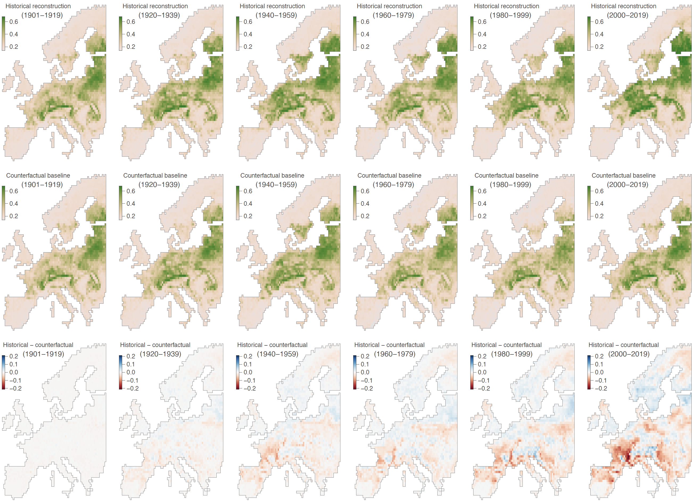

Impact of climate change on European bumblebees
===============

This repo gathers the input files and scripts related to our study entitled "**Contribution of climate change to the decline of European bumblebee populations**" (De Tandt *et al*., *in prep.*). R scripts used to conduct the different ecological niche modelling and projections described in that study are all available in `Script_ENM_study.r`.

Climate change is a major driver of biodiversity loss, particularly for insects that are experiencing widespread and rapid declines. However, quantifying the contribution of climate change among multiple co-occurring pressures remains challenging. Here, we disentangle its effects by comparing predictions of areas ecologically suitable for European bumblebee species from 1901 to 2019 under factual simulations to a counterfactual baseline in which long-term warming trends were removed. We highlight that climate change led to continental-scale declines in ecological suitability for bumblebees across Europe, especially in the Atlantic, Continental, Mediterranean and Pannonian regions. Colder and higher altitudes areas of the Alpine and Boreal regions show no net change in ecological suitability for these species, reflecting localised gains consistent with upwards and northwards redistribution offset by losses elsewhere. Overall, our results demonstrate that climate change is reshaping the ecologically suitable areas to these key pollinators and represents a pervasive pressure on European ecosystems.

**Figure 1. Isolated impact of climate change on the ecological suitability of Europe for 47 bumblebee species.** We here report, for each period, the difference between bumblebee ecological suitability estimates based on (i) the reconstructions of the historical climate (first row) and (ii) a counterfactual baseline (second row). The third row of maps reports the difference, for each time period, between the two, i.e., between the estimates based on the reconstructions of the historical climate and a counterfactual baseline. Specifically, we here focus on the ecological suitability index (ESI) defined as the local mean ecological suitability averaged over species (and thus ranging from 0 to 1). The computation of the ESI metric was thus based on species-specific ecological suitability maps, which were obtained by averaging over the estimates of ten independent BRT models trained on present-day data retrieved from the ISIMIP3a reanalysis dataset GSWP3-W5E5. See Figures S5-S7 for the corresponding results based on the three other ISIMIP3a reanalysis datasets — 20CRv3, 20CRv3-ERA5, and 20CRv3-W5E5 — considered in the present study.