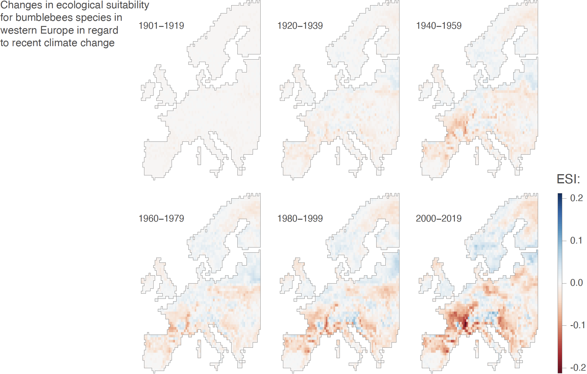

Impact of climate change on European bumblebees
===============

This repo gathers the input files and scripts related to our study entitled "**Evaluating the impact of climate change on the decline of European bumblebee populations**" (De Tandt *et al*. *submitted*). R scripts used to conduct the different ecological niche modelling and projections described in that study are all available in `Script_ENM_study.r`.

**Figure 1. Investigating the changes in ecological suitability for bumblebees in regard to climate change over the last century in Europe.** We here report, for each period, the difference between the bumblebee ecological suitability estimates based on (i) the reconstructions of the historical climate and (ii) a counterfactual baseline. Specifically, we here focus on the ecological suitability index (ESI) defined as the local mean ecological suitability averaged over species (and thus ranging from 0 to 1). The computation of the ESI metric was thus based on species-specific ecological suitability maps, which were obtained by averaging over the estimates of ten independent BRT models trained on present-day data retrieved from the ISIMIP3a reanalysis dataset GSWP3-W5E5. See Figure S5 for the maps reporting the absolute ESI and species richness index (SRI) values for this reanalysis dataset, as well as Figures S6-S8 for the corresponding results based on the three other ISIMIP3a reanalysis datasets — 20CRv3, 20CRv3-ERA5, and 20CRv3-W5E5 — considered in the present study.