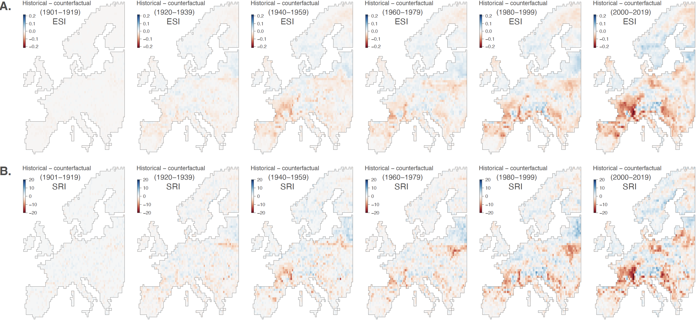

Impact of climate change on European bumblebees
===============

This repo gathers the input files and scripts related to our study entitled "**Evaluating the impact of climate change on the decline of European bumblebee populations**" (De Tandt *et al*. *submitted*). R scripts used to conduct the different ecological niche modelling and projections described in that study are all available in `Script_ENM_analyses.r`.

